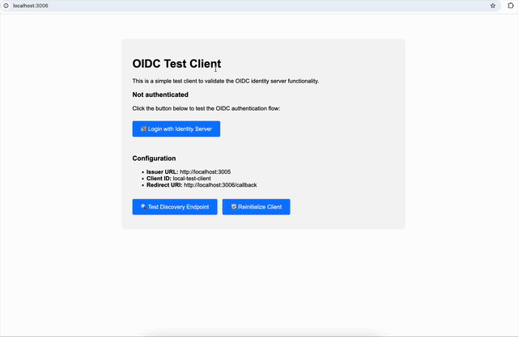

# Identity Server

A modern OIDC Identity Server with multi-tenant admin UI, robust MFA, and quick application + user pool setup. Built for local dev, Docker, and integration with an external "core" stack.



## Features

- OIDC Provider with multi-tenant support
- Modern Bootstrap admin UI
- Integrated Application + User Pool creation
- Robust MFA flows
- Dockerized for easy local/dev use
- Test consumer app for OIDC flows

## Architecture

```
         ┌─────────────────────────────┐
         │      Identity Server        │
         │  (http://localhost:3005)    │
         └─────────────┬───────────────┘
                       │
         ┌─────────────▼───────────────┐
         │     Admin Interface         │
         │ (http://localhost:3005/admin) │
         └─────────────┬───────────────┘
                       │
         ┌─────────────▼───────────────┐
         │     Test Client App         │
         │  (http://localhost:3006)    │
         └─────────────────────────────┘
```

> ⚡ Requires external "core" stack (PostgreSQL, etc.) running via Docker.

## Quick Start

```sh
# Start everything (default: PostgreSQL backend)
./rebuild.sh
```

- Admin UI: [http://localhost:3005/admin](http://localhost:3005/admin)
- Test Client: [http://localhost:3006/](http://localhost:3006/)

## Usage

- Create applications and user pools from the Admin UI
- Test OIDC flows with the built-in test client
- Switch backend: `./rebuild.sh rebuild dynamodb`
- Migrate DB: `./rebuild.sh migrate`
- View logs: `./rebuild.sh logs identity-server`

## Configuration

- Data provider: `postgresql` (default) or `dynamodb`
- All static assets are local (no CDN required)

## File Structure

```
├── src/           # Server code
├── views/         # EJS templates (admin, auth, test)
├── scripts/       # DB migration, provisioning
├── test-client/   # OIDC test consumer app
├── docker/        # Dockerfiles
├── rebuild.sh     # Main management script
└── docker-compose.yml
```

---

> See the demo GIF above for a walkthrough.  
> For advanced usage, see `./rebuild.sh help`.

---
# identity-server
